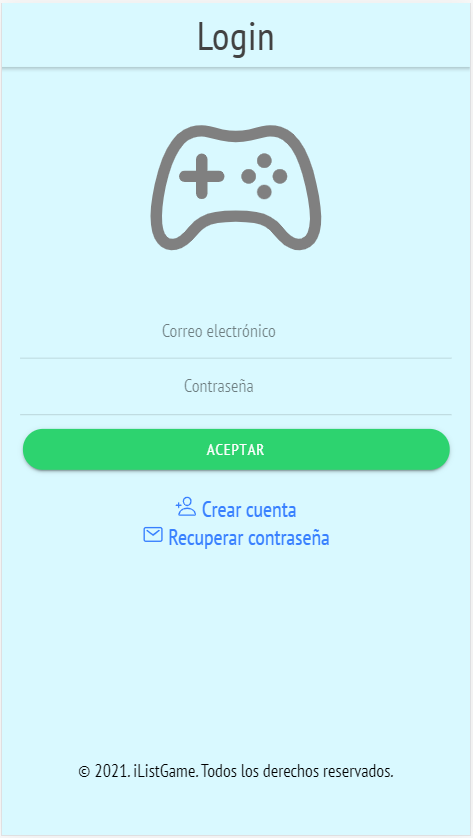

# iList-Game-v2

Aplicación desarrollada para la asignatura Acceso a Datos en el 2º año de CFGS Desarrollo de Aplicaciones Multiplataforma.  

iList-Game-v2 es una aplicación en la que podremos y agregar a una lista todos los videojuegos que queramos, siendo esta pública para todo el mundo.
Podremos seleccionar el videojuego que queramos y agregarlo a nuestra propia lista de juegos, ya sea porque los hemos jugado, los tenemos pendiente para terminar o porque nos gusten.  

https://ilist-game-v2.web.app

## Login
La primera pantalla que nos encontraremos es la de acceso a la lista de juegos con nuestro perfil. En ella podremos hacer login (si estamos registrados) ó pulsar sobre el botón de "Crear Cuenta".    

## Crear Cuenta
Pantalla de creación de cuenta para iList-Game. Para ello agregaremos una cuenta de correo electrónico y una contraseña.    

## Recuperación de Contraseña
Si tenemos cuenta pero se nos olvidadó la contraseña... ¡No te preocupes!. Si pulsamos sobre el botón de "Recuperar contraseña", accederemos a la pantalla en la que se nos solicitará un correo electrónica al que poder enviar la nueva contraseña de recuperación de cuenta.    

## Pantalla principal - Lista de Juegos
En esta lista, podremos apreciar una lista completa sobre juegos que se han ido agregando a lo largo del uso de la aplicación. Esta lista es completamente pública por lo tanto, cualquier usuario puede ir agregando videojuegos.    

## Agregar un videojuego
En esta pantalla, podemos ir añadiendo videojuegos los cuáles se van a ir agregando a la Lista de Juegos, que es la pantalla principal.    

## Menú de navegación
Si pinchamos en el menú hamburguesa que nos aparece en la parte superior, podemos acceder a distintos puntos de la aplicación. En este caso podremos "Cerrar Sesión", ver "Mi Lista" y obtener información de la aplicación en "Sobre Aplicación".    

## Mi Lista -- Acceso privado para cada usuario
Al desplegar el menú hamburguesa, podemos acceder al apartado "Mi Lista", al cuál podremos ver una lista con los videojuegos que nosotros hayamos agregado anteriormente de la lista de Juegos de la pantalla principal, los cuales, se irán agregando respectivamente cuando le vayamos dando al botón verde de añadir.  
Dentro de la lista como hemos dicho anteriormente, vamos a poder ver los juegos agregados. Al igual que hemos podido agregar, vamos a poder eliminar pulsando sobre la papelera del botón rojo.    

## Sobre la Aplicación
Pantalla sobre la que aparecerá una breve explicación sobre el funcionamiento de la aplicación junto con el nombre del desarrollador y el enlace al perfil de Github    

## Vídeo sobre la Aplicación iList-Game v.2.0 en Youtube

https://youtu.be/OucamVdFPeg

## Futuras Versiones
[ ] Insertar en menú desplegable la opción de "Mi Perfil" y poder editar y ver todos los datos de usuario.
[ ] Tocar sobre el nombre del videojuego y que nos aparezca una pequeña información sobre el mismo.
[ ] Poder hacer un ranking de nota media entre todos los usuarios y notas que se le den a los juegos.
[ ] Implementar la clasificación del juego por estrellas.
[ ] En el perfil poder agregar un nombre de usuario y crear una pequeña red entre jugadores.
[ ] Implementar el apartado de la cámara para poder agregar nuestras propias caratulas.

##
Si te gustó la aplicación no olvides dejar tu estrellita ⭐

